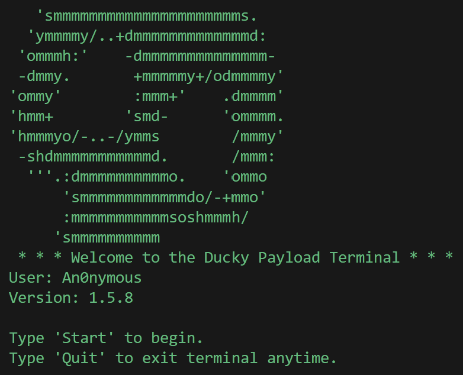

# Ducky Payload Terminal 👋

Python tool for sending and receiving Ducky Script-style payloads over open ports and replaying them via local UI automation.

---

## About This Project

- `Receiver.py` listens on a TCP port and processes a small “Ducky Script”-style command set.
- `remote.py` is a simple client that can send a text payload to a target host.
- `Payload.txt` is a sample payload format.

## Authorization (Password)

To reduce accidental execution while testing, the receiver enforces a basic password gate:

- Payloads must include a `PASSWORD <code>` line.
- If the password is missing or incorrect, the payload is canceled and no actions are executed.

`Payload.txt` includes an example `PASSWORD 0000` line.

## Contact

- YouTube: https://www.youtube.com/@ModSpidr
- Portfolio: https://gregorybridges.dev
- Email: contact@gregorybridges.dev
